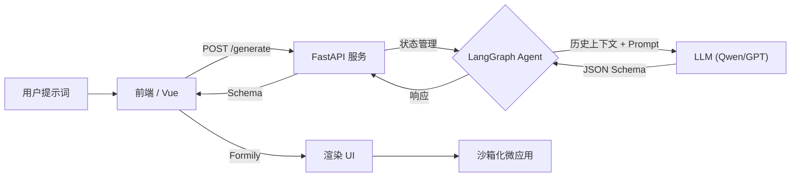

# GenCard Studio 🔮

> **基于 LLM、Vue 3 和 LangGraph 的生成式 UI 引擎**
>
> *一句话生成交互式组件、数据仪表盘和网页小游戏。*


**GenCard Studio** 是一个实验性的生成式 UI (Generative UI) 低代码平台。它利用 AI Agent 实时生成、渲染和优化用户界面。

与传统的代码生成器不同，GenCard Studio 具备**上下文感知 (Context-Aware)** 能力，允许用户通过自然语言对话，对已生成的界面进行多轮微调（例如：“把按钮改成红色”、“让贪吃蛇的速度慢一点”），而无需重新生成。

## ✨ 核心特性

* **🎨 文本生成 UI (Text-to-UI)**: 输入自然语言提示词，即可生成复杂的卡片、表单、仪表盘布局。
* **🗣️ 上下文感知修改**: 不满意？直接对话。Agent 会记住当前的 UI 状态，并进行精准的增量修改。
* **🕹️ 动态代码嵌入 (Embeds)**: 支持生成完整的 **HTML/JS 微应用**（如贪吃蛇、俄罗斯方块、计算器、图表），并在安全的沙箱中运行。
* **⚡ 实时渲染引擎**: 基于 **Formily** 和 **Vue 3**，将后端生成的 JSON Schema 毫秒级转换为真实组件。
* **🛡️ 健壮的代码生成**: 内置严格的 Prompt 工程，确保生成的代码无语法错误，且格式清晰便于调试。

## 📸 效果演示

| **贪吃蛇游戏 (Embed 组件)** | **iOS 风格计算器 (CSS Grid)** |
|:---:|:---:|
|  |  |
| *提示词: "生成一个可玩的贪吃蛇..."* | *提示词: "生成一个iOS风格的计算器..."* |

## 🛠️ 技术栈

* **前端 (Frontend)**:
    * [Vue 3](https://vuejs.org/) (Composition API)
    * [Formily](https://formilyjs.org/) (Schema 驱动渲染)
    * [Ant Design Vue](https://antdv.com/) (UI 组件库)
    * Vite
* **后端 (Backend)**:
    * [FastAPI](https://fastapi.tiangolo.com/) (Python API 服务)
    * [LangChain](https://www.langchain.com/) & [LangGraph](https://langchain-ai.github.io/langgraph/) (Agent 编排与状态管理)
    * LLM 支持: 兼容 OpenAI 格式的模型 (本项目测试基于阿里云 Qwen/通义千问)

## 🚀 快速开始

### 前置要求
* Node.js (v16+)
* Python (v3.9+)
* 一个兼容 OpenAI 格式的大模型 API Key (如 OpenAI, Qwen, DeepSeek)。

### 1. 后端设置

```bash
# 进入 server 目录
cd server

# 安装依赖
pip install -r requirements.txt

# 创建环境变量文件
# Windows 用户使用: type nul > .env
touch .env
```

**配置你的 `.env` 文件:**
```env
# 示例：使用阿里云 DashScope (通义千问)
DASHSCOPE_API_KEY=sk-your-api-key-here
```

**启动后端服务:**
```bash
python main.py
# 服务将运行在 http://localhost:8000
```

### 2. 前端设置

```bash
# 进入 client 目录
cd client

# 安装依赖
npm install

# 启动开发服务器
npm run dev
```

在浏览器中打开 `http://localhost:5173` (或终端显示的端口)。

## 💡 使用指南

### 模式 1: 创建模式 (✨ Creation Mode)
直接描述你想要的界面：
* *"生成一个赛博朋克风格的警告卡片，带有倒计时功能。"*
* *"生成一个包含邮箱和密码输入框的登录表单。"*

### 模式 2: 修改模式 (✏️ Context-Aware Mode)
一旦 UI 生成完毕，系统会自动进入修改模式。你可以继续对话：
* *"红色的背景太刺眼了，换成深灰色。"*
* *"在提交按钮旁边加一个取消按钮。"*
* *"贪吃蛇移动得太快了，把速度降到 50%。"*

### 模式 3: 应用/游戏生成 (🚀 App Generation)
如果需要复杂的交互逻辑，请明确要求使用 **Embed** 组件或生成 **游戏**：
* *"生成一个可玩的俄罗斯方块游戏，使用 Embed 组件。"*
* *"生成一个科学计算器，要求支持加减乘除。"*

## 🧠 系统架构



## 📄 开源协议

本项目基于 MIT 协议开源。详情请参阅 `LICENSE` 文件。
